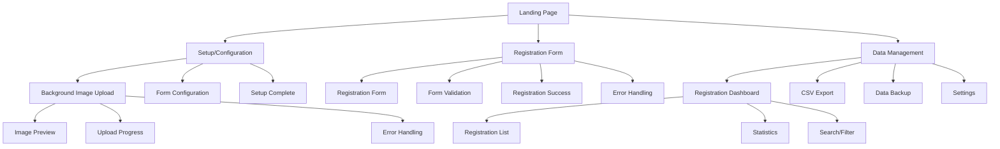
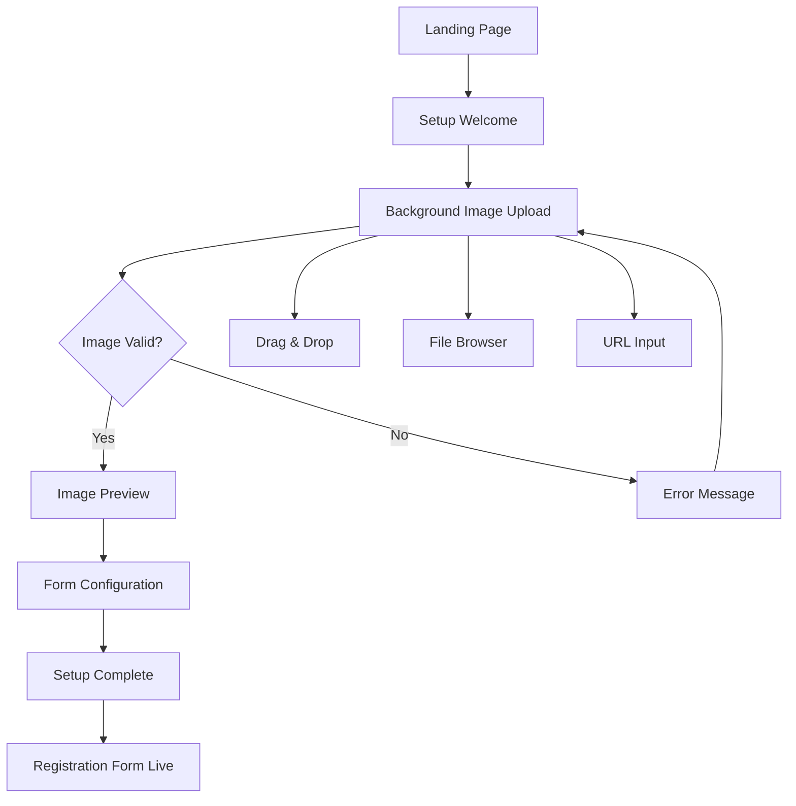
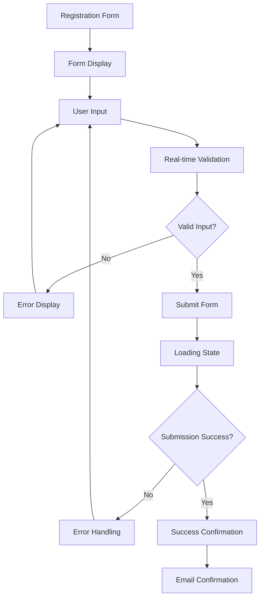
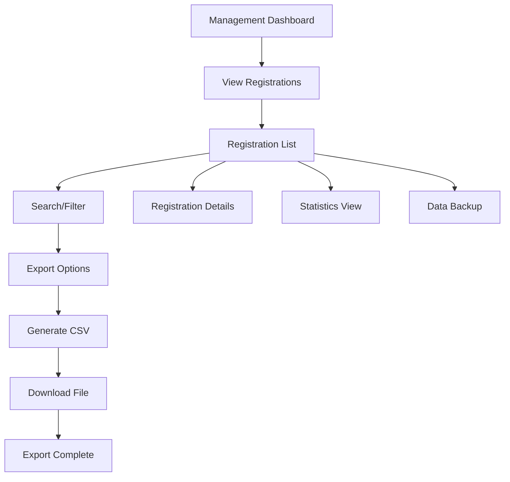

# Event Registration System UI/UX Specification

**Version:** 1.0  
**Date:** August 29, 2025  
**Status:** Draft for Review

---

## Introduction

This document defines the user experience goals, information architecture, user flows, and visual design specifications for the Event Registration System's user interface. It serves as the foundation for visual design and frontend development, ensuring a cohesive and user-centered experience.

### Overall UX Goals & Principles

#### Target User Personas

**Event Organizer (Primary):**
- Small to medium event organizers, community leaders, meetup organizers
- Limited technical expertise, values simplicity and professional presentation
- Needs quick setup, visual customization, and easy data management
- Goals: Professional event branding, efficient attendee management, reliable data export

**Event Attendee (Secondary):**
- General public registering for events
- Expects smooth, professional registration experience
- Values clear information, easy form completion, and confirmation
- Goals: Quick registration, clear event information, confirmation of successful registration

#### Usability Goals

- **Ease of Learning:** New organizers can set up a registration form in under 10 minutes
- **Efficiency of Use:** Attendees can complete registration in under 2 minutes
- **Error Prevention:** Clear validation and immediate feedback for all form interactions
- **Professional Presentation:** Visual design enhances event branding and credibility
- **Accessibility:** WCAG AA compliance ensures inclusive user experience
- **Mobile Optimization:** Seamless experience across all device sizes

#### Design Principles

1. **Simplicity First** - Prioritize clarity and ease of use over feature complexity
2. **Visual Customization** - Background images should enhance, not hinder, user experience
3. **Progressive Disclosure** - Show only essential information, reveal details as needed
4. **Immediate Feedback** - Every action should have clear, instant response
5. **Accessible by Default** - Design for all users from the start, not as an afterthought
6. **Professional Polish** - Clean, modern aesthetic that reflects event quality

### Change Log

| Date | Version | Description | Author |
|------|---------|-------------|---------|
| 2025-08-29 | 1.0 | Initial UI/UX specification creation | Sally, UX Expert |

---

## Information Architecture (IA)

### Site Map / Screen Inventory

### Navigation Structure

**Primary Navigation:** Simple, minimal navigation focused on core functions - Setup, Registration, and Management

**Secondary Navigation:** Contextual navigation within each section (e.g., image management within setup)

**Breadcrumb Strategy:** Clear breadcrumbs for multi-step processes, especially in setup and management flows

---

## User Flows

### Flow 1: Event Setup and Configuration

**User Goal:** Event organizer sets up registration form with custom background image

**Entry Points:** Landing page, direct setup URL

**Success Criteria:** Registration form is live and accessible with custom background

**Flow Diagram:**

**Edge Cases & Error Handling:**
- Invalid file format (show supported formats)
- File too large (show size limit and compression options)
- Upload failure (retry mechanism)
- Network connectivity issues (offline handling)

**Notes:** Focus on visual feedback and progress indication throughout the setup process

### Flow 2: Event Registration

**User Goal:** Attendee completes registration form successfully

**Entry Points:** Public registration URL, QR code, email link

**Success Criteria:** Registration data saved, confirmation shown

**Flow Diagram:**

**Edge Cases & Error Handling:**
- Form validation errors (clear, specific messages)
- Network timeout (retry with progress indication)
- Duplicate submissions (prevent and inform)
- Browser compatibility issues (graceful degradation)

**Notes:** Ensure form is accessible via keyboard navigation and screen readers

### Flow 3: Data Management and Export

**User Goal:** Event organizer accesses registration data and exports to CSV

**Entry Points:** Management dashboard, direct management URL

**Success Criteria:** CSV file downloaded with complete registration data

**Flow Diagram:**

**Edge Cases & Error Handling:**
- Large dataset export (progress indication)
- Export failure (retry mechanism)
- File download issues (alternative download methods)
- Data corruption (backup and recovery)

**Notes:** Provide clear feedback on export progress and file location

---

## Wireframes & Mockups

### Design Files
**Primary Design Files:** Figma wireframes and mockups (to be created)
**Prototype Links:** Interactive prototypes for user testing

### Key Screen Layouts

#### Screen 1: Landing Page
**Purpose:** Welcome page with setup options and information

**Key Elements:**
- Hero section with value proposition
- "Create Registration Form" call-to-action
- Feature highlights (background customization, CSV export)
- Simple navigation to setup

**Interaction Notes:** Clear visual hierarchy, prominent setup button, professional presentation

**Design File Reference:** Landing-Page-Wireframe

#### Screen 2: Setup/Configuration
**Purpose:** Step-by-step setup process for event organizers

**Key Elements:**
- Progress indicator
- Background image upload area with drag-and-drop
- Image preview with overlay options
- Form field configuration
- Setup completion confirmation

**Interaction Notes:** Visual feedback for each step, clear progress indication, intuitive image upload

**Design File Reference:** Setup-Configuration-Wireframe

#### Screen 3: Registration Form
**Purpose:** Public-facing registration form for attendees

**Key Elements:**
- Custom background image display
- Registration form fields (name, email, phone)
- Form validation with real-time feedback
- Submit button with loading state
- Success confirmation

**Interaction Notes:** Responsive design, accessible form elements, clear validation messages

**Design File Reference:** Registration-Form-Wireframe

#### Screen 4: Data Management Dashboard
**Purpose:** Event organizer's view of registrations and data

**Key Elements:**
- Registration count and statistics
- Recent registrations list
- Search and filter functionality
- CSV export button
- Settings and backup options

**Interaction Notes:** Clean data presentation, easy export access, responsive table design

**Design File Reference:** Management-Dashboard-Wireframe

---

## Component Library / Design System

### Design System Approach
**Custom Design System:** Create a lightweight, purpose-built design system focused on simplicity and professional presentation

### Core Components

#### Component 1: Form Input
**Purpose:** Standardized form input with validation states

**Variants:** Text input, email input, phone input, textarea

**States:** Default, focus, error, success, disabled

**Usage Guidelines:** Consistent styling, clear labels, accessible focus indicators

#### Component 2: Button
**Purpose:** Primary and secondary action buttons

**Variants:** Primary (solid), Secondary (outline), Danger (red), Disabled

**States:** Default, hover, active, loading, disabled

**Usage Guidelines:** Clear hierarchy, appropriate sizing, loading states for async actions

#### Component 3: Image Upload
**Purpose:** Background image upload with preview

**Variants:** Drag-and-drop area, file browser, URL input

**States:** Empty, uploading, preview, error, success

**Usage Guidelines:** Clear upload area, immediate preview, error handling

#### Component 4: Data Table
**Purpose:** Registration data display and management

**Variants:** Basic table, sortable table, searchable table

**States:** Empty, loading, populated, error

**Usage Guidelines:** Responsive design, accessible headers, clear data presentation

#### Component 5: Modal/Dialog
**Purpose:** Confirmation dialogs and detailed information

**Variants:** Confirmation, information, form modal

**States:** Open, closing, error

**Usage Guidelines:** Clear focus management, accessible close options, keyboard navigation

---

## Branding & Style Guide

### Visual Identity
**Brand Guidelines:** Clean, professional aesthetic that enhances event branding without competing with custom backgrounds

### Color Palette

| Color Type | Hex Code | Usage |
|------------|----------|-------|
| Primary | #2563EB | Primary buttons, links, focus states |
| Secondary | #64748B | Secondary elements, borders |
| Accent | #F59E0B | Highlights, important notices |
| Success | #10B981 | Success states, confirmations |
| Warning | #F59E0B | Warnings, important notices |
| Error | #EF4444 | Error states, destructive actions |
| Neutral | #F8FAFC, #E2E8F0, #64748B, #1E293B | Backgrounds, borders, text |

### Typography

#### Font Families
- **Primary:** Inter (sans-serif) - Clean, modern, highly readable
- **Secondary:** Inter (for consistency)
- **Monospace:** JetBrains Mono (for code elements if needed)

#### Type Scale

| Element | Size | Weight | Line Height |
|---------|------|--------|-------------|
| H1 | 2.25rem (36px) | 700 | 1.2 |
| H2 | 1.875rem (30px) | 600 | 1.3 |
| H3 | 1.5rem (24px) | 600 | 1.4 |
| Body | 1rem (16px) | 400 | 1.6 |
| Small | 0.875rem (14px) | 400 | 1.5 |

### Iconography
**Icon Library:** Lucide Icons (clean, consistent, accessible)

**Usage Guidelines:** Consistent sizing (16px, 20px, 24px), semantic meaning, accessible labels

### Spacing & Layout
**Grid System:** 8px base unit, responsive grid with 12 columns

**Spacing Scale:** 4px, 8px, 12px, 16px, 24px, 32px, 48px, 64px

---

## Accessibility Requirements

### Compliance Target
**Standard:** WCAG 2.1 AA

### Key Requirements

**Visual:**
- Color contrast ratios: Minimum 4.5:1 for normal text, 3:1 for large text
- Focus indicators: Clear, visible focus rings on all interactive elements
- Text sizing: Support for 200% zoom without horizontal scrolling

**Interaction:**
- Keyboard navigation: Full keyboard accessibility for all functionality
- Screen reader support: Semantic HTML, ARIA labels, proper heading structure
- Touch targets: Minimum 44px touch targets for mobile interactions

**Content:**
- Alternative text: Descriptive alt text for all images, especially background images
- Heading structure: Logical heading hierarchy (H1, H2, H3)
- Form labels: Explicit labels for all form inputs, error messages clearly associated

### Testing Strategy
- Automated testing with axe-core
- Manual testing with screen readers (NVDA, VoiceOver)
- Keyboard navigation testing
- Color contrast verification
- Mobile accessibility testing

---

## Responsiveness Strategy

### Breakpoints

| Breakpoint | Min Width | Max Width | Target Devices |
|------------|-----------|-----------|----------------|
| Mobile | 320px | 767px | Smartphones, small tablets |
| Tablet | 768px | 1023px | Tablets, large phones |
| Desktop | 1024px | 1439px | Laptops, small desktops |
| Wide | 1440px | - | Large desktops, monitors |

### Adaptation Patterns

**Layout Changes:** Single column on mobile, multi-column on larger screens

**Navigation Changes:** Hamburger menu on mobile, horizontal navigation on desktop

**Content Priority:** Essential content first, progressive enhancement for larger screens

**Interaction Changes:** Touch-friendly on mobile, hover states on desktop

---

## Animation & Micro-interactions

### Motion Principles
- **Purposeful:** Every animation serves a clear purpose
- **Smooth:** 60fps animations with appropriate easing
- **Accessible:** Respect user motion preferences
- **Fast:** Quick, responsive interactions

### Key Animations
- **Form Validation:** Subtle shake for errors, smooth checkmark for success (Duration: 300ms, Easing: ease-out)
- **Button States:** Smooth hover and focus transitions (Duration: 200ms, Easing: ease-in-out)
- **Page Transitions:** Fade in/out for page changes (Duration: 400ms, Easing: ease-in-out)
- **Loading States:** Skeleton screens and progress indicators (Duration: 1000ms, Easing: linear)
- **Image Upload:** Progress bar and preview fade-in (Duration: 500ms, Easing: ease-out)

---

## Performance Considerations

### Performance Goals
- **Page Load:** Under 3 seconds on 3G connection
- **Interaction Response:** Under 100ms for user interactions
- **Animation FPS:** 60fps for all animations

### Design Strategies
- Optimize images for web display
- Implement lazy loading for non-critical content
- Use CSS transforms for animations
- Minimize layout shifts with proper sizing
- Progressive enhancement for core functionality

---

## Next Steps

### Immediate Actions
1. Create detailed wireframes in Figma
2. Develop interactive prototypes for user testing
3. Establish component library and design tokens
4. Conduct accessibility audit of wireframes
5. Prepare design handoff documentation

### Design Handoff Checklist
- [x] All user flows documented
- [x] Component inventory complete
- [x] Accessibility requirements defined
- [x] Responsive strategy clear
- [x] Brand guidelines incorporated
- [x] Performance goals established

---

## Checklist Results

*To be populated after running UX checklist*

---

*Document prepared by: Sally, UX Expert (BMAD Method)*  
*Next Review: After wireframe creation and user testing*
